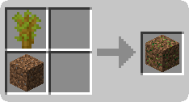
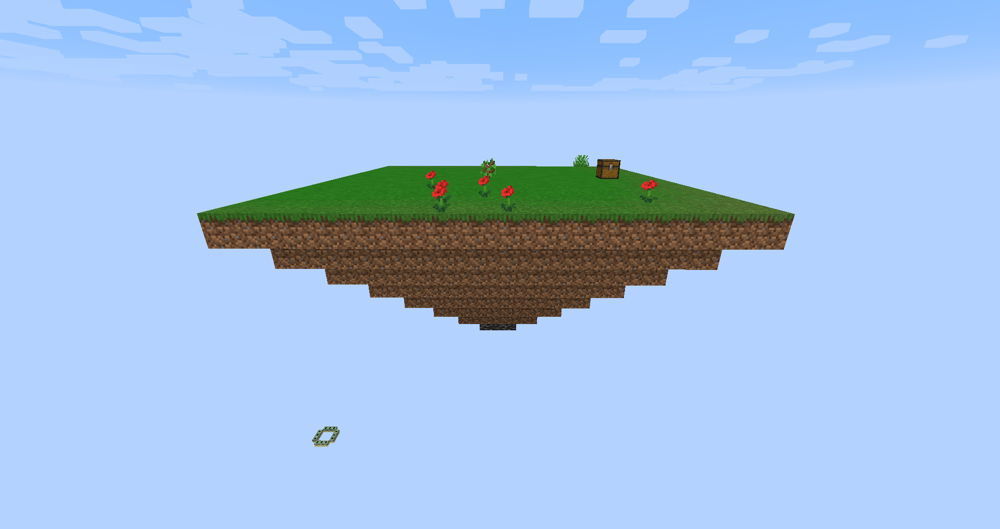
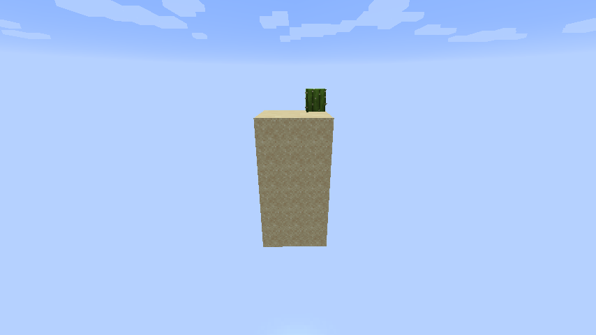
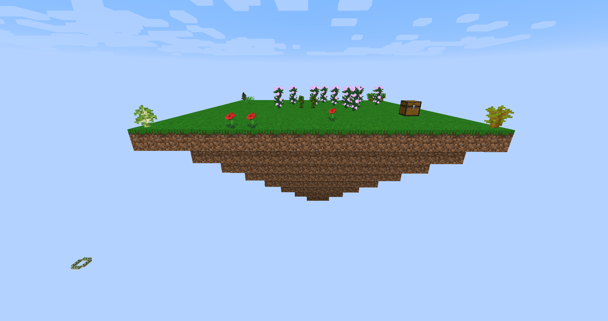
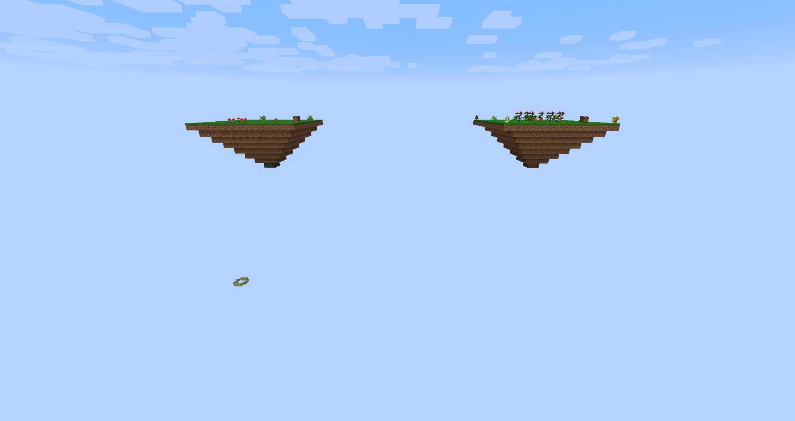

# Sky Breezes

## Dependencies
This mod uses two libraries to add extra features and to be able to use certain features that are expected to exist on custom dimensions, but are not unless the dimensions get mutable levels
- [DimensionMutability](https://github.com/Linguardium/DimensionMutability/tree/90695d166f9abc1672223219653ce3659e901e3d) - [MIT License](https://github.com/Linguardium/DimensionMutability/blob/90695d166f9abc1672223219653ce3659e901e3d/LICENSE). Used for the player to be able to use a bed to sleep on the Sky Breezes dimension while having the sleep action have an effect on the time of the day among other features that are not available on custom dimensions by default.
- [Cardinal Components API](https://github.com/OnyxStudios/Cardinal-Components-API) - [MIT License](https://github.com/OnyxStudios/Cardinal-Components-API/blob/master/LICENSE.md). Used to give each different player a different island when they teleport to the Sky Breezes dimension. Also used to allow the player to be able to teleport back to the Sky Breezes dimension when they come back from The Nether if they entered The Nether through the Sky Breezes dimension. 
# How to

The first thing you want to do to get to the Sky Breezes dimension is craft a Sky Breezes dirt block. The block can be crafted with any vanilla saplings and a block of dirt.
  

Then all you have to do is step on the block and it will teleport you to the Sky Breezes dimension.

Alternatively you can use the command `/teleport_to_sky_breezes_dimension` and it will teleport you to the dimension. If you are already in the dimension, it will teleport you to the Overworld.

## Gathering Materials
To get more dirt blocks, you can mine other dirt blocks on the default biome of the Sky Breezes dimension. There is a 30% chance that the dirt block will drop two extra dirt blocks in addition to the mined one.

To get coal ore or iron ore, cobblestone can be mined on the default biome of the Sky Breezes dimension.
Cobblestone has a 10% chance of dropping one of either coal ore or iron ore in addition to iteself.

To get gold ore, iron ore can be mined on the default biome of the Sky Breezes dimension.
Iron ore has a 5% chance of dropping a gold ore block in addition to itself.

To get diamond ore or redstone ore, gold ore can be mined on the default biome of the Sky Breezes dimension.
Gold ore has a 1% chance of dropping one of either diamond ore or redstone ore in addition to itself.

To get lapis ore, redstone ore can be mined on the default biome of the Sky Breezes dimension.
Redstone ore has a 10% chance of dropping lapis ore in addition to the redstone drop.

To get sand or gravel, sand can be mined on the default biome of the Sky Breezes dimension.
Sand has a 50% chance of dropping two of either sand or gravel in addition to itself.

To get obsidian, obsidian can be mined on the default biome of the Sky Breezes dimension.
Obsidian has a 50% chance of dropping two of obsidian in addition to itself.

To get carrots, potatoes, or beetroot seeds, grass can be broken on the default biome of the Sky Breezes dimension.
Grass has a 1% chance of dropping one of carrot, potato, or beetroot seed in addition to possibly dropping seeds for wheat.

## Biomes
### Default Biome
This is the default biome of the dimension. 
All spawn islands are always created in this biome.
In this biome, mining certain blocks allow the player to get other blocks as defined on the
Gathering Materials section.

### Cold Biome
In the cold biome of the Sky Breezes dimension, it snows if the weather status is raining.
This biome occupies only 1 chunk, but because the biome generation is not exactly squared,
parts of a chunk may not be cold. The Cold Biome of the Sky Breezes dimension can be found every 8 chunks 
(or 128 blocks) in a **diagonal** on any directon.

# Screenshots

## Licenses

This mod is available under the CC0 license. 

The dependency: [DimensionMutability](https://github.com/Linguardium/DimensionMutability/tree/90695d166f9abc1672223219653ce3659e901e3d) is available under the [MIT license](https://github.com/Linguardium/DimensionMutability/blob/90695d166f9abc1672223219653ce3659e901e3d/LICENSE).

The dependency: [Cardinal Components API](https://github.com/OnyxStudios/Cardinal-Components-API) is available under the [MIT License](https://github.com/OnyxStudios/Cardinal-Components-API/blob/master/LICENSE.md).
