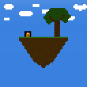

# Sky Breezes

## Dependencies
This mod uses a library which helps in removing the Experimental World Screen when creating and opening a world.
- [ExperimentAway](https://github.com/Linguardium/ExperimentAway) - Used to remove the screen that shows a warning about the world using experimental unsupported settings. MIT License

# How to

The first thing you want to do to get to the Sky Breezes dimension is craft a Sky Breezes dirt block. The block can be crafted with any vanilla saplings and a block of dirt.
  

Then all you have to do is step on the block and it will teleport you to the Sky Breezes dimension.

Alternatively you can use the command `/teleport_to_sky_breezes_dimension` and it will teleport you to the dimension. If you are already in the dimension, it will teleport you to the Overworld.

# Screenshots

## License

This mod is available under the CC0 license. The dependency: ExperimentAway is available under the MIT license.
